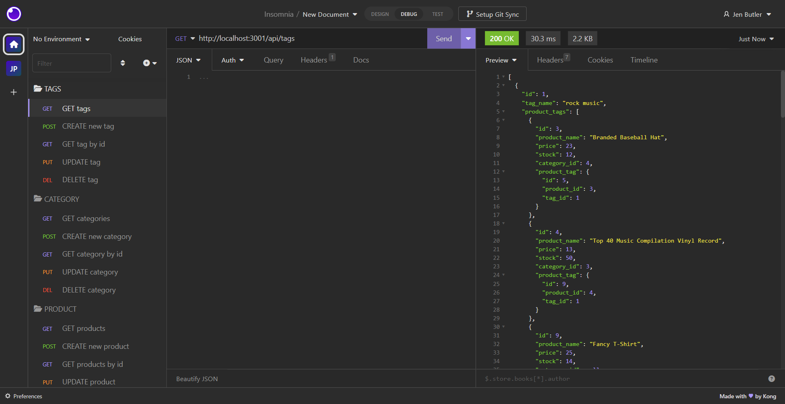

# RestfulRetail

## Description

As a new developer, building an e-commerce app like this is incredibly beneficial. It allows me to immerse myself in the booming world of online retail, with its vast market and growth potential. By working on this project, I gain hands-on experience with cutting-edge technologies such as Express.js, Sequelize, and MySQL, which are highly sought after in the industry. Understanding the fundamental architecture of e-commerce platforms is crucial for becoming a well-rounded full-stack web developer. Moreover, successfully completing this project demonstrates my ability to deliver real-world solutions, giving me a competitive edge and a valuable portfolio piece to showcase my skills to potential clients and employers.

## Table of Contents

- [Installation](#installation)
- [Usage](#usage)
- [License](#license)
- [Credits](#credits)
- [Tests](#tests)
- [Contact](#contact)

## Installation

1. Install all the project dependencies and set up your environment variables.
2. Clone this repository git@github.com:justjenb/RestfulRetail.git.
3. Navigate to the directory containing server.js.
4. Run the server using npm start from the terminal.
5. Open your preferred IDE for making web queries (Postman, Insomnia).
6. Run GET, POST, PUT, DEL requests against API endpoints:
api/tags
api/categories
api/products

## Usage

[Link to video demo](https://drive.google.com/file/d/10h29T8cn5S5PJmJf2km1yb7c83AbW2jr/view)

## License

**This project is licensed under the [MIT](https://opensource.org/licenses/MIT) license.**

For more information about this license, please visit the following link:

https://opensource.org/licenses/MIT

## Credits

References:

https://stackoverflow.com/questions/50354817/sequelize-decimal-data-save-with-2-decimal-points

## Tests

No tests.

## Contact

My name is Jen Butler.

Here is a link to my [GitHub](https://github.com/justjenb) profile. 

Additional contact details:

You can email me at jen@jenbutler.me
